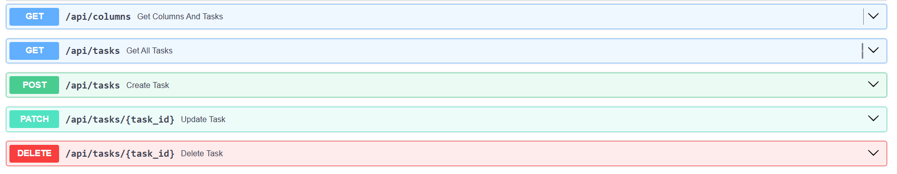

# 🧩 Trello-like Task Board

A full-stack Trello-style task board application built with **React**, **Tailwind CSS**, and a **FastAPI (Python)** backend. It supports drag-and-drop, task creation, editing, deletion, and persistent state management.

---

## Backend Setup(FastAPI)

- Prerequisites: Python, pip
- Setup:
    - Navigate to the trello-board\backend folder
    - **Create a virtual environment** :
        py -m venv env
        .\env\Scripts\Activate  
    - **Install dependencies(Adready done , no need to do)**:
        py -m pip install fastapi uvicorn
    - **Run the backend server(in trello-board folder)**:
        uvicorn backend.main:app --reload --host 127.0.0.1 --port 8000
**The backend API will now be available at: http://127.0.0.1:8000**

## Frontend Setup(React + Vite + Tailwind CSS)

- **Install frontend dependencies (inside the frontend/ folder)**:
    npm install

- **Start the development server**:
    npm run dev

**The app will be live at: http://localhost:5173**
        

## 🚀 Features

- Drag-and-drop task organization across columns
- Create, edit, and delete tasks
- Backend-powered task management with FastAPI
- Column-based task tracking (To Do, In Progress, Done)

---

## 📁 Project Structure

task-board/
├── frontend/ 
| ├── src/
| │ ├── components/
| | │ ├── column.jsx 
│ | | └── TaskCard.jsx
│ | ├── App.jsx 
│ | └── main.jsx
├── backend/ 
| ├── routes/
| │ └── tasks.py
│ ├── models.py 
│ ├── memory.py 
│ └── main.py
└── README.md

# API Endpoints

